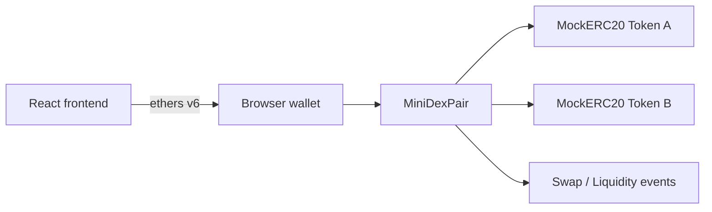

# miniDEX

A deliberately small DEX-style application split into two packages:

- `dex/`: Hardhat JavaScript project with a constant-product AMM, ERC-20 test tokens, tests, and deployment script.
- `frontend/`: React + Vite client using ethers v6 for wallet connection and transaction handling.

## Local quickstart

```bash
cd dex
npm install
npm test
npx hardhat node
# in another terminal
npm run deploy:local
```

Copy the three deployment addresses from the deploy output into `frontend/.env` as `VITE_PAIR_ADDRESS`, `VITE_TOKEN_A_ADDRESS`, and `VITE_TOKEN_B_ADDRESS`.

```bash
cd frontend
npm install
npm run dev
```

Use a browser wallet configured for Hardhat local network (`http://127.0.0.1:8545`, chain ID `31337`). Import one of the accounts printed by `npx hardhat node`. The initial deployer owns the initial token supply; use the `mint` function from a contract console or seed accounts as needed.

## Testnet deployment

Copy `dex/.env.example` to `dex/.env`, set `SEPOLIA_RPC_URL` and `PRIVATE_KEY`, then run `npm run deploy:sepolia`. This demo uses an intentionally minimal test ERC-20 and should only be deployed with test tokens on a testnet.

## AMM mathematics

The pool maintains reserves $x$ and $y$ with the invariant $k = x * y$. For an input $amountIn` and a 0.30% fee:

$$amountInWithFee = amountIn * 9970$$

For an input `amountIn` and a 0.30% fee:

Liquidity providers receive shares proportional to their deposit. The first deposit mints approximately $\sqrt{amountA * amountB}$ shares minus permanently locked minimum liquidity. Later deposits use the smaller of each reserve-relative share to keep the pool balanced.

## Architecture



## Contract surface

- `addLiquidity(amountA, amountB, minLiquidity)` transfers both tokens and mints LP accounting shares.
- `removeLiquidity(liquidity, minAmountA, minAmountB)` burns shares and returns proportional reserves.
- `quote(amountIn, aForB)` performs the fee-adjusted constant-product calculation.
- `swap(aForB, amountIn, minAmountOut)` enforces the user minimum before transferring tokens and updating reserves.

The UI separates approval from the swap so the user can inspect and confirm each transaction. It shows quote, minimum received, price impact, pending hash, and confirmation state.

## Security considerations

This is an educational implementation, not production-ready DeFi infrastructure. A production pair would need audited OpenZeppelin ERC-20 behavior, reentrancy protection, safe-transfer wrappers for non-standard tokens, a factory/router, protocol fee policy, reserve sync protections, oracle/TWAP support, stronger token validation, and fuzz/invariant testing. The frontend should also validate chain ID and use a trusted deployment registry before handling real assets. Slippage protects the user from worse execution, but it cannot prevent all MEV or sandwich risk.
